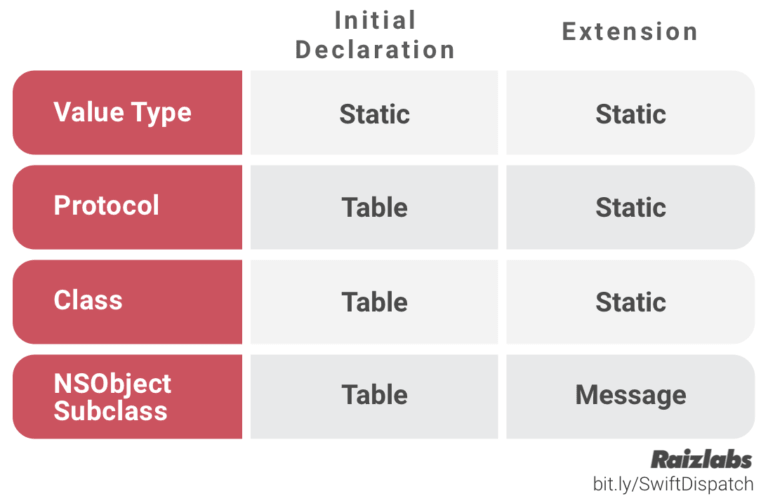
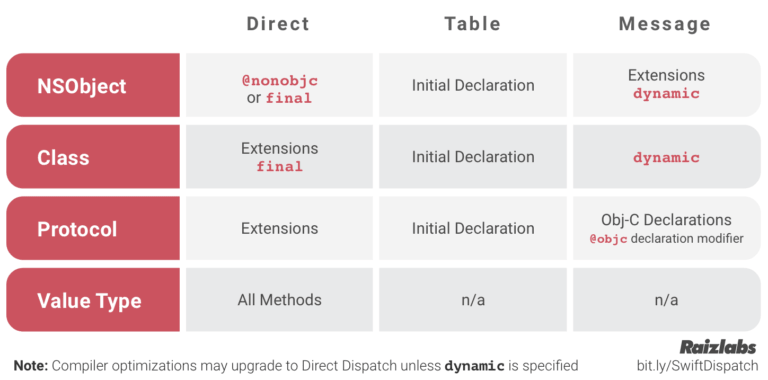

# Swift 方法派发纪要

| 类型                   | 说明                                                         |      |
| ---------------------- | ------------------------------------------------------------ | ---- |
| Value 类型             | struct, enum 这样的值类型不支持继承，所以无需动态派发，所有的方法调用（包括遵守的协议方法），都是直接调用 虽然不支持继承，但值类型还是可以通过 extension 和 Protocol 可以实现扩展 |      |
| 纯 Swift Class 类型    | 默认使用函数表派发，影响它方法调用的关键字有 final、dynamic 和 extension  - 函数如果被标记成 final，编译器就会知道这个方法不会被 override，并把它的调用方式标记成直接调用。  - 当一个方法被标记为 dymanic，你必须同时把它标记上@objc，此时这个方法会使用 Message 调用，依赖 Objc runtime。  - 因为定义在 extension 中的方法目前还不支持 override，所以定义在其中的方法都是直接派发的  - 对于未标记成 final 并在 class 内部（非 extension）中定义的方法，Swit 会用一种叫作 Virtual Table 的机制来在运行时查找到这个方法并进行调用。 |      |
| NSObject Subclass 类型 | 影响这种类型的函数调用方式的关键字和上面一样，但是表现却不完全一样  - 标记为 final 和 dynamic 的函数可以参考上面的 class  - 在原生声明（非 extension）中定义的普通方法和标记为@obic 的方法都使用 V-table 机制派发。  - 在 extension 中定义的方法使用 Message 调用，依赖 Objc runtime |      |

## Swift 派发原理

- Dispatch
  - Dispatch 派发，指的是语言底层找到用户想要调用的方法，并执行调用过程的动作
  - Call 调用，指的是语言在高级层面，指示一个函数进行相关命令的行为

对于编译型语言来说，一般有三种方式可以派发到方法：**静态派发**，**基于 Table 的派发**，**消息派发**

- Java 默认是使用 Table 方式派发的，你可以使用 final 关键字来强制动态派发

- C++默认是静态派发的，你可以使用 virtual 关键字来启用 Table 派

-  Objective-C 全都基于消息派发，不过也允许你使用 C level 的函数直接派发。

- Swift 应对不同的情巧妙的使用了这三种方法

### Direct Dispatch 直接派发

- 又叫：静态派发。因为它的汇编命令少，且可以应用很多编译器进行优化，比如 inline 优化
- 不过这种方式局限性最大，因为不够动态而无法支持子类。

### Table(函数表)派发

基于 Table 的派发机制是编译语言最常用的方式。

Table 一般是用函数地址的数组来存储每个类的声明（Vtable），不过 Swift 中还有术语叫做 Witness Table (Wtable）是服务于 Protocol 的。

每个子类都会有自己的 Vtable 副本，子类中 override 的方法指针也会被替换成新的，子类新添加的方法则会被添加在 Table 的尾部。程序会在运行时确定每个函数具体的地址。

表的查找就实现而言非常简单，而且性能可以预测，不过还是比直接派发更慢一些。这种方法多了两步查找和一步跳转，这些都是开销。而且，这种方法没法使用一些编译器的优化方法。

另一个缺点在于，这种基于数组的派发让 extension 没法扩展这个 table。因为在子类添加方法列表到尾部后，extension 就没有一个安全的 index 可以添加他的方法到  table

## 链接

- [Method Dispatch in Swift](https://www.rightpoint.com/rplabs/switch-method-dispatch-table)